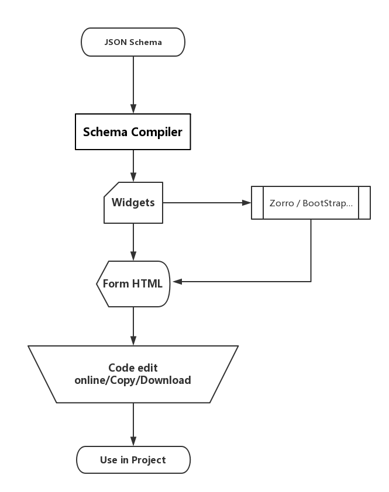
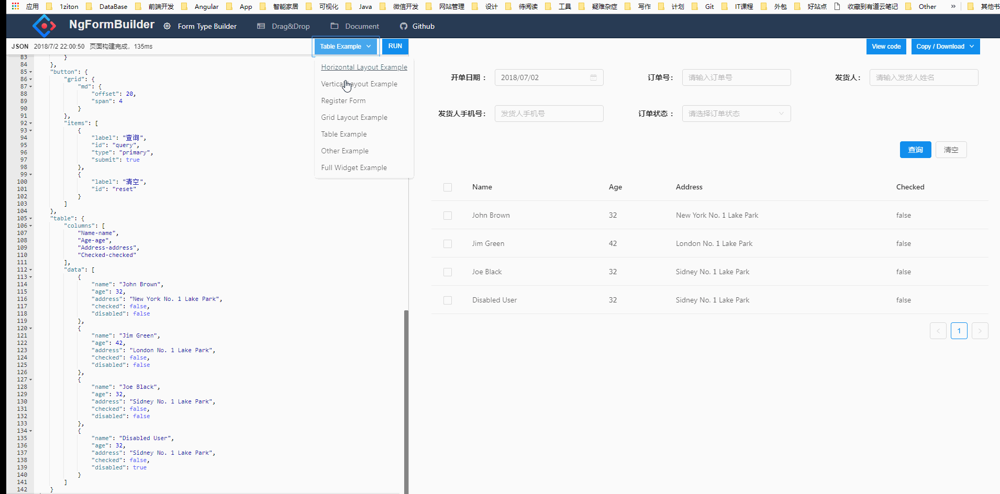

# ngx-form-builder

Angular Form generation base on ng6.x,dynamic template support ng-zorro-antd/BootStrap UI

Online Demo: http://form.giscafer.com

## TODO List

- [x] Form generation based on JSON schema `v0.1.0`
- [x] Support download & copy the generated code `v0.1.0`
- [x] Support ngModel auto-binding `v0.1.0`
- [x] Support `BootStrap` template `v0.1.0`
- [x] Support `ng-zorro-antd` template  `v0.1.0`
- [x] Support `ng-zorro-antd` template code edit on StackBlitz `v0.1.3`
- [ ] Support `Java vo` —> `json schema` —> generate-> `ng template` 
- [ ] Support DND (drag and drop)
- [ ] Support Form Validator

## Usage

Run `npm run start` for a dev server. Navigate to `http://localhost:8888/`.

## ScreenShot

__the project is under developing__

## Related

- [angular2-schema-form](https://github.com/makinacorpus/angular2-schema-form) `ngx-form-builder` base on angular2-schema-form
- [formBuilder](https://github.com/kevinchappell/formBuilder)
- [nz-schema-form](https://github.com/cipchk/nz-schema-form)
- [ng-zorro-antd](https://github.com/NG-ZORRO/ng-zorro-antd)

## Issues

- [build --aot Runtime compiler is not loaded](https://stackoverflow.com/questions/42706113/angular-cli-build-prod-runtime-compiler-is-not-loaded/42843683#42843683)
- JitCompilerFactory Bug at Angular 5 & not support AOT [angular/angular #20639](https://github.com/angular/angular/issues/20639)
- [JIT Complier needed with AOT Build for Dynamic Component9](https://github.com/angular/angular/issues/20875)
- [Angular's integration example](https://github.com/angular/angular/blob/d7a727cc0728a61a707f2c109636c1fa077042c2/integration/dynamic-compiler/src/app.module.ts#L16)

## License

MIT

---

> [giscafer.com](http://giscafer.com) &nbsp;&middot;&nbsp;
> GitHub [@giscafer](https://github.com/giscafer) &nbsp;&middot;&nbsp;
> Twitter [@nickbinglao](https://twitter.com/nickbinglao) &nbsp;&middot;&nbsp;
> Weibo [@Nickbing_Lao](https://weibo.com/laohoubin)