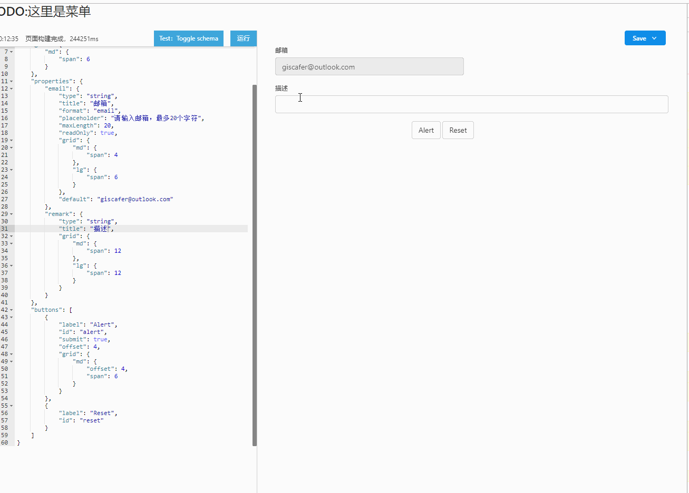

# ng-form-builder

Angular form generation,dynamic template support primeng/zorro/bootstrap UI

Online Demo: http://form.giscafer.com

## TODO List

- [x] HTML form generation based on JSON Schema
- [x] Support download & copy HTML code
- [x] Support ng template html & ngModel auto binding
- [x] Support `BootStrap` style
- [ ] Support `PrimeNG` UI
- [ ] Support `NG-ZORRO` UI
- [ ] Support form validator
- [ ] Support `Java vo` —> `json schema` —>generate-> `ng html` 
- [ ] Support DND (drag and drop)

## Usage

Run `npm run start` for a dev server. Navigate to `http://localhost:8888/`.

## ScreenShot

__the project is under developing__

## Related

- [angular2-schema-form](https://github.com/makinacorpus/angular2-schema-form) `ng-form-builder` base on angular2-schema-form
- [formBuilder](https://github.com/kevinchappell/formBuilder)
- [primeng](https://github.com/primefaces/primeng)
- [ng-zorro-antd](https://github.com/NG-ZORRO/ng-zorro-antd)

## Issues

- [build --aot Runtime compiler is not loaded](https://stackoverflow.com/questions/42706113/angular-cli-build-prod-runtime-compiler-is-not-loaded/42843683#42843683)
- JitCompilerFactory Bug at Angular 5 & not support AOT [angular/angular #20639](https://github.com/angular/angular/issues/20639)

## License

MIT

---

> [giscafer.com](http://giscafer.com) &nbsp;&middot;&nbsp;
> GitHub [@giscafer](https://github.com/giscafer) &nbsp;&middot;&nbsp;
> Twitter [@nickbinglao](https://twitter.com/nickbinglao) &nbsp;&middot;&nbsp;
> Weibo [@Nickbing_Lao](https://weibo.com/laohoubin)